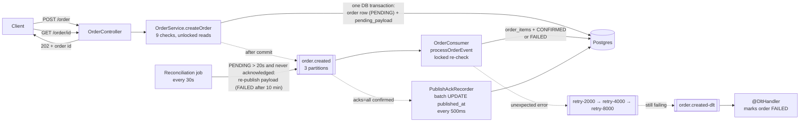

# Fastfood API — Milestones 1, 2 & 3

Backend Engineering Project — Impactis × TCS
High-Performance API Systems, Phase 1–3: RESTful Application + Caching + Async Order Processing

---

## What this is

A Spring Boot backend for a food delivery app simulation.

- **Milestone 1** covers the core RESTful application — data model, all 7 required endpoints, validation, error handling, and testing.
- **Milestone 2** adds Redis caching on `GET /restaurants` and `GET /menu` — see [Milestone 2 — Caching (Redis)](#milestone-2--caching-redis) below.
- **Milestone 3** moves order processing off the request thread onto Kafka — see [Milestone 3 — Async order processing (Kafka)](#milestone-3--async-order-processing-kafka) below.

Query optimization is intentionally deferred to a later phase.

## Tech stack

- **Java 21**, **Spring Boot 4.1.1**
- **PostgreSQL 16** (via Docker)
- **Redis 7** (via Docker) — response caching, Milestone 2
- **Apache Kafka** (Confluent `cp-kafka` 7.6, KRaft mode, via Docker) + **Spring Kafka** — async order processing, Milestone 3
- **Maven** for build and dependency management
- **Spring Data JPA / Hibernate** for database access
- **Spring Security (BCrypt only)** — used purely for password hashing, not authentication
- **JUnit 5 + Mockito** for testing
- **JaCoCo** for coverage reporting
- **K6** for load testing

## How to run this

**1. Start the database, cache and message broker**

```
cd fast-food-api
docker compose up -d
```

This starts Postgres, Redis and Kafka in containers; Postgres automatically creates all 5 tables from `init.sql`. Kafka runs in KRaft mode (no Zookeeper) and is reachable from the host at `localhost:9092`. The app creates its own topics on startup.

**2. Run the application**

Open the `fastfood` folder in IntelliJ and run `FastfoodApplication`, or from the terminal:

```
cd fastfood
.\mvnw spring-boot:run
```

The app starts on `http://localhost:8080`.

**3. Run the tests**

```
.\mvnw clean test
```

Coverage report is generated at `target/site/jacoco/index.html`.

---

## Endpoints

### `GET /restaurants`
Returns all restaurants.

**Response 200:**
```json
[
  {
    "id": "909176a9-6dc9-4832-81f5-dbd9f71ac759",
    "name": "Sagar Ratna",
    "description": "North Indian comfort food",
    "cuisine": "North Indian",
    "deliveryFee": 30.00,
    "minOrderAmount": 150.00,
    "isActive": true,
    "createdAt": "2026-09-01T19:04:35.660535Z",
    "updatedAt": "2026-09-01T19:04:35.660535Z"
  }
]
```

### `GET /restaurants/{restaurantId}`
Returns one restaurant by ID. Returns **404** if not found.

### `POST /restaurants`
Creates a new restaurant.

**Request:**
```json
{
  "name": "Sagar Ratna",
  "description": "North Indian comfort food",
  "cuisine": "North Indian",
  "deliveryFee": 30.00,
  "minOrderAmount": 150.00
}
```
**Response:** 201, restaurant object with generated `id`.

### `POST /restaurants/{restaurantId}/menu-items`
Adds a menu item to a restaurant. Returns **404** if the restaurant doesn't exist.

**Request:**
```json
{
  "name": "Butter Chicken",
  "description": "Rich, creamy tomato-based curry",
  "price": 320.00,
  "calories": 550
}
```
**Response:** 201, menu item object including `restaurantId`.

### `GET /menu?restaurantId=`
Returns all menu items for a restaurant.

### `POST /users`
Creates a new user. Password is hashed with BCrypt before storage — the raw password is never saved. Returns **409** if the email is already registered.

**Request:**
```json
{
  "email": "priya@example.com",
  "password": "mysecretpass123",
  "firstName": "Priya",
  "lastName": "Sharma",
  "phone": "9876543210"
}
```
**Response:** 201, user object — no password field of any kind in the response.

### `POST /order`
Places an order. This is the core business-logic endpoint. Since Milestone 3 it validates synchronously, saves the order as `PENDING`, and hands the rest of the work to Kafka. It returns **202 Accepted** as soon as that is done (see [Milestone 3](#milestone-3--async-order-processing-kafka)). A bad request still gets an immediate 404/400, exactly as before. Validates, in order:

1. User exists (404)
2. Restaurant exists (404)
3. Restaurant is active (400)
4. At least one item was ordered (400)
5. Every menu item ID exists (404)
6. Every menu item belongs to the requested restaurant (400)
7. Every menu item is currently available (400)
8. Every quantity is at least 1 (400)
9. Order subtotal meets the restaurant's minimum (400)

**Prices are always read from the database, never trusted from the request** — the request DTO has no price field at all, by design. This closes the obvious vulnerability where a client could set their own price.

**Request:**
```json
{
  "userId": "09a85a76-9458-418c-bcc1-a1e942da5825",
  "restaurantId": "909176a9-6dc9-4832-81f5-dbd9f71ac759",
  "deliveryAddress": "12 Civil Lines, Roorkee",
  "deliveryNotes": "Ring the bell twice",
  "items": [
    { "menuItemId": "925c610a-ea5d-4b14-ab24-67e76f116c65", "quantity": 2, "specialInstructions": "extra spicy" }
  ]
}
```
**Response 202:** (the `items` here are a provisional breakdown from the synchronous check; the stored order items are written by the consumer)
```json
{
  "id": "af303706-5718-44e3-907d-9a3a937e0cf9",
  "userId": "09a85a76-9458-418c-bcc1-a1e942da5825",
  "restaurantId": "909176a9-6dc9-4832-81f5-dbd9f71ac759",
  "subtotal": 640.00,
  "deliveryFee": 30.00,
  "total": 670.00,
  "status": "PENDING",
  "items": [
    {
      "menuItemId": "925c610a-ea5d-4b14-ab24-67e76f116c65",
      "menuItemName": "Butter Chicken",
      "quantity": 2,
      "unitPrice": 320.00,
      "totalPrice": 640.00
    }
  ]
}
```

### `GET /order/{orderId}`
*(Milestone 3)* Returns an order and its current `status`: `PENDING` (queued, not yet processed), `CONFIRMED` (order items saved), or `FAILED` (rejected during processing). `items` is only populated once the order is `CONFIRMED`. Returns **404** if the order doesn't exist.

---

## Error handling

Every error returns a consistent shape via a global exception handler:

```json
{
  "timestamp": "2026-09-01T19:07:07.0...",
  "status": 404,
  "error": "Not Found",
  "message": "Restaurant not found: 00000000-0000-0000-0000-000000000000",
  "path": "/restaurants/00000000-0000-0000-0000-000000000000"
}
```

| Situation | Status |
|---|---|
| Resource doesn't exist (bad ID) | 404 |
| Business rule broken (inactive restaurant, below minimum, mismatched menu item) | 400 |
| Duplicate resource (email already registered) | 409 |
| Anything unexpected | 500, generic message (no internal details leaked) |

---

## Testing

`OrderServiceTest` covers the core order logic with 9 tests, using Mockito to fake all repository dependencies (and, since Milestone 3, the `KafkaTemplate`). No real database or broker is touched, and the tests run in a few seconds.

- Happy path — correct subtotal, delivery fee, and total calculation; order saved as `PENDING`
- User not found → `ResourceNotFoundException`
- Inactive restaurant → `BusinessRuleException`
- Order below minimum → `BusinessRuleException`
- Price is taken from the database entity, not the request — proves the security fix works
- *(Milestone 3)* Consumer skips an order that is no longer `PENDING`, so a redelivered message saves nothing twice
- *(Milestone 3)* Consumer marks the order `FAILED` without throwing when a business rule fails on the re-check, so it doesn't trigger pointless retries
- *(Milestone 3)* A publish Kafka acknowledges is recorded; a failed publish is not (the order then stays unacknowledged, for reconciliation)

`OrderReconciliationSchedulerTest` (2 tests) checks the job's give-up decision: an unacknowledged order within the 10-minute limit is re-published, and one past it is marked `FAILED` instead.

`PublishAckRecorderTest` (2 tests) checks the batching: 2,500 acknowledged orders become 3 `UPDATE` statements (1,000 + 1,000 + 500), and an empty queue touches the database not at all.

The Kafka flows themselves (retries, DLT, duplicates, scaling) were verified live against the real broker. See [Live test results](#live-test-results) below.

**Coverage (JaCoCo):**

| Package | Coverage | Notes |
|---|---|---|
| `service` | 60% | Core business logic — where testing effort was concentrated |
| `config` | 72% | Cache + Kafka wiring, exercised by the context-load test |
| `messaging` | 45% | Kafka consumer + (de)serializers — the flows were verified live instead |
| `dto` | 40% | Mostly data-holding classes |
| `entity` | 0% | Data classes only, no logic to test |
| `exception` | 10% | Not yet covered |
| `controller` | 25% | Not yet covered |
| **Total** | **50%** | |

*(Updated for Milestone 3. JaCoCo was also bumped from 0.8.12 to 0.8.15: the old version couldn't read the Java 25 class files Mockito generates at runtime, so earlier reports under-counted.)*

Testing effort was deliberately focused on `OrderService`, since that's where the actual business rules and calculations live. Entity and DTO classes are mostly generated getters/setters with no logic worth testing directly.

---

## Load testing (K6)

Burst test against `GET /restaurants`: ramped to 50 concurrent virtual users over 10s, held for 20s, ramped down over 10s.

| Metric | Result |
|---|---|
| Total requests | 102,583 |
| Throughput | 2,564 req/s |
| p95 latency | 21.7ms |
| Failure rate | 0.00% |

Both configured thresholds passed (`p95 < 1000ms`, `failure rate < 5%`) with wide margin. This is the Phase 1 baseline — Phase 2/3 caching and query optimization will be measured against these numbers.

**Known limitation:** load testing was run on a local development laptop (Acer Nitro V 15, i5-13420H, 16GB RAM) with Docker, the JVM, and K6 all competing for the same resources. Numbers may differ on dedicated hardware.

---

## Milestone 2 — Caching (Redis)

### What's cached

| Endpoint | Cache name | Key | TTL |
|---|---|---|---|
| `GET /restaurants` | `restaurants` | (none — one shared entry, the full list) | 10 minutes |
| `GET /menu?restaurantId=` | `menus` | `restaurantId` | 2 minutes |

**Why these TTLs:** restaurants rarely change (nothing currently writes to the `restaurants` cache — see below), so a longer window is safe and cuts DB load further. Menus change more often — new items, availability toggles — so a shorter window caps how stale a menu can ever get at 2 minutes.

An empty menu (a restaurant with zero items) still gets cached correctly — `@Cacheable` only skips caching a `null` return value, and an empty list isn't `null`.

### Cache invalidation on writes

`POST /restaurants/{restaurantId}/menu-items` evicts that restaurant's `menus` entry (`@CacheEvict(value = "menus", key = "#restaurantId")`) so a newly added item appears on the very next `GET /menu` call instead of waiting up to 2 minutes. Only that restaurant's entry is evicted — every other restaurant's cached menu is untouched.

**Design decision:** there's currently no working `POST /restaurants` endpoint in the codebase to evict the `restaurants` cache from (see *Known gaps* below), so no eviction was added for it. If restaurant creation is implemented later, it should evict the `restaurants` cache the same way, or that cache's 10-minute TTL becomes the only thing standing between a new restaurant and it actually showing up.

### Redis-down resilience

If Redis is unreachable, `GET /restaurants` and `GET /menu` still return correct data from Postgres — they don't fail. This comes from two changes:

- **`CacheConfig.errorHandler()`** — a custom `CacheErrorHandler` that logs a warning instead of letting a Redis exception propagate on a cache get/put/evict/clear failure. Spring's cache interceptor treats a swallowed get-error as a miss, so the real (database) method just runs as if nothing were cached.
- **`spring.data.redis.timeout=1s` / `connect-timeout=1s`** in `application.properties` — without this, Lettuce's default 60-second command timeout means a request would hang for a full minute before the error handler ever got a chance to fall back. Bounding it to 1s makes the fallback actually feel graceful instead of like a hang.

Verified by killing the Redis container while the app was running: the very next request still returned `200` with correct data in ~1 second, with a `WARN` logged. The app also starts up fine if Redis is already down when it boots.

### Hit/miss observability

`ObservableRedisCache` / `ObservableRedisCacheManager` (in `config/`) log every lookup as `Cache HIT` or `Cache MISS`, with the cache name and key. This exists because `@Cacheable`'s method body only ever runs on a miss — there's no place inside `RestaurantService` or `MenuItemService` themselves to log a hit. Sample log output:

```
Cache MISS [restaurants] key=SimpleKey [] — loading from the database
Hibernate: select r1_0.id, ... from restaurants r1_0
Cache HIT  [restaurants] key=SimpleKey []
```
(note: no `Hibernate:` line before the HIT — confirming Postgres wasn't touched.)

### Bugs found and fixed while wiring this up

- `@Cacheable("restaurants")` was on the `RestaurantService` **class**, not on `getAllRestaurants()` — meaning it silently applied to every public method in the class, including `getRestaurantById`. Moved to the one method it was meant for.
- `MenuItemRepository.findByRestaurantId` returned `MenuItem`s holding a lazy Hibernate proxy for `restaurant`. Caching that proxy embedded an internal `hibernateLazyInitializer` field in the JSON that Jackson couldn't read back — every cache HIT for `/menu` returned a 500. Fixed with a `JOIN FETCH` so `restaurant` is a real, already-loaded object by the time it gets cached.
- `GenericJacksonJsonRedisSerializer.builder().build()` doesn't embed type information by default, so a cache HIT deserialized entities into plain `LinkedHashMap`s instead of `MenuItem`/`Restaurant` objects — also a 500. Fixed by enabling default typing, scoped to a `PolymorphicTypeValidator` that only allows `com.dev.fastfood.*` plus the specific JDK value-type packages actually in use (`java.util`, `java.math`, `java.time`, `java.lang`) — not "allow any class," since this cache only ever needs to hold our own types.

All three were only visible by actually hitting the endpoint twice and reading the response body, not from compiling or starting the app — the first request (a cache miss) always looked fine either way.

---

## Milestone 3 — Async order processing (Kafka)

### Why

Before Milestone 3, `POST /order` did all of its work inside the HTTP request, including taking pessimistic row locks on the restaurant and menu items. Every concurrent order for the same restaurant queued behind that lock while its client waited. Milestone 3 keeps the fast, cheap checks on the request path and moves the locked, authoritative work to a Kafka consumer.

### Architecture



**Request path (synchronous):** the same 9 validation checks as before, with the same 404/400 responses. Then the order row is saved as `PENDING` together with the JSON event it's about to publish (`orders.pending_payload`), and the client gets **202 Accepted**.

**Consumer path (asynchronous):** `OrderConsumer` re-runs the validation using the same pessimistic-locking queries Milestone 1 introduced, because a restaurant or menu item can change between the two checks. Then it either saves the order items and marks the order `CONFIRMED`, or marks it `FAILED`. The event carries only IDs and quantities, never prices; prices are always re-read from the database.

### Partitions: why 3

A topic is split into partitions, and within one consumer group each partition is read by only one consumer at a time. The partition count is therefore the cap on how many consumer instances can work in parallel. We chose 3 because:

- It's enough to demonstrate scaling. With 2 instances, one gets 2 partitions and the other gets 1 (verified below).
- It leaves room for a 3rd instance without reconfiguring the broker.
- It's a single-broker laptop setup, and more partitions only adds overhead here.

Messages are keyed by order ID, so every message about the same order lands on the same partition and is processed in order, by one consumer, never concurrently.

### Retries and the Dead Letter Topic

There are two kinds of failure, handled differently on purpose:

| Failure | Example | Handling |
|---|---|---|
| **Business rule** (expected, terminal) | Restaurant deactivated between the two checks | Order marked `FAILED` right away. No retry, because retrying can never fix it. |
| **Unexpected error** (possibly transient) | DB error, bug | `@RetryableTopic`: 4 attempts in total, with 2s, 4s and 8s backoff on separate retry topics, so the main partition is never blocked while waiting. Then the message goes to `order.created-dlt`, and the `@DltHandler` marks the order `FAILED`. |
| **Unreadable message** ("poison pill") | Not valid JSON | `ErrorHandlingDeserializer` catches it, and it goes **straight to the DLT** (no retries) with its original bytes preserved. Processing of other messages continues. |

A message is never silently dropped. It either succeeds or ends up in the DLT, and the order is never left `PENDING` forever.

### Idempotency (duplicate deliveries)

Kafka guarantees *at-least-once* delivery, so the same message can arrive more than once (after a crash, a rebalance, or an error-handler seek). The idempotency key is the order's own status. If a message arrives for an order that is no longer `PENDING`, it's logged and skipped. Combined with keying by order ID (so duplicates never run in parallel), a duplicate can never create a second set of order items.

Offsets are committed manually (`AckMode.MANUAL`), only after `processOrderEvent` has committed its DB transaction. If the app dies halfway through, the message is redelivered rather than lost.

### The dual-write problem

Saving to Postgres and publishing to Kafka are two separate systems with no shared transaction. This is handled in two layers:

1. **Publish only after the DB commit** (`TransactionSynchronization.afterCommit`), so a consumer can never see an event for an order that was rolled back.
2. **Record when Kafka acknowledges the publish** (`orders.published_at`). The producer uses `acks=all`: a send only counts as successful once the broker confirms the message is written to *every* in-sync copy of the partition. When that confirmation arrives, the order ID is queued, and `PublishAckRecorder` stamps `published_at` on up to 1,000 orders per `UPDATE`, twice a second.
3. **Reconciliation job** (`OrderReconciliationScheduler`, every 30s). It only looks at orders that are `PENDING` for more than 20s **and have no `published_at`**, meaning Kafka never confirmed their publish (for example, the app crashed between the commit and the send). It re-publishes those from their saved `pending_payload`. The idempotency check makes that safe even if the original publish did get through. This is a simple form of the *transactional outbox* pattern.

**Why acknowledged orders are left alone:** once Kafka has confirmed a message, it's stored. Even if it's waiting behind a long queue, the retry/DLT path guarantees the order ends `CONFIRMED` or `FAILED`. The first version of this job couldn't tell "lost" from "queued": under a K6 burst it re-published **123,664** duplicates of orders that were merely waiting (see the load test below).

**It doesn't retry forever.** An order whose publish Kafka still hasn't acknowledged after **10 minutes** (`fastfood.reconciliation.give-up-after`, default `10m`) is marked `FAILED`, and the reason is logged at ERROR level. Because only unacknowledged orders reach this check, an order that's just waiting in a long queue is never failed by it. In practice it only fires if Kafka itself has been unreachable for about that long.

- It's measured by age rather than by counting attempts, because `created_at` already exists and age is what the customer actually waits through.
- 10 minutes still allows ~19 re-publish attempts, one per 30s run.
- Marking it `FAILED` is a single conditional `UPDATE … WHERE status = 'PENDING'`, and the consumer holds a row lock on the order while it works. So the job can never overwrite an order the consumer is confirming at that moment.

**Honest caveat on `acks=all` here:** this dev setup has one broker, so the topic has a single copy, and "every in-sync copy" means just that one. If that broker crashed before the data reached disk, an acknowledged message could still be lost. In production you'd run 3 brokers with `replicas(3)` and `min.insync.replicas=2`, so an acknowledged message survives losing a broker.

### Live test results

All run against the real Postgres, Redis and Kafka containers.

| Test | What we did | Result |
|---|---|---|
| Normal flow | `POST /order`, then poll `GET /order/{id}` | 202 in ~40–85ms (warm), `CONFIRMED` ~100ms later |
| Consumer offline | Placed orders while no consumer was running, then started one | All queued orders processed within ~240ms of the consumer joining; none lost |
| Retry → DLT | Published an event whose order items overflow `numeric(10,2)` (a real DB error) | Attempts at +0s, +2s, +4s, +8s, then DLT; order `FAILED` with **0** partial order items (each attempt rolled back) |
| Poison pill | Published 3 non-JSON messages, then 3 valid orders | Bad messages went straight to the DLT with original bytes; the 3 valid orders were `CONFIRMED` |
| Duplicate delivery | Published the same event twice back-to-back | 1 × `CONFIRMED`, 1 × "already CONFIRMED — skipping", exactly 1 order item row |
| Scaling | Ran a 2nd instance on port 8081 | Partitions split `[2]` / `[0, 1]` (`kafka-consumer-groups --describe`); 12 orders processed 3 / 9 |
| Failover | Force-killed the 2nd instance | The 1st instance took over all 3 partitions after ~43s (Kafka's 45s session timeout; a graceful shutdown hands over almost immediately) |
| Publish acknowledged | Placed an order, checked `published_at` | Recorded ~0.1–0.3s after creation; still set after the consumer saved the order as `CONFIRMED` |
| Give-up only when unacknowledged | Inserted two `PENDING` orders, both 11 minutes old: one with `published_at`, one without | Unacknowledged one → `FAILED` on the next run; acknowledged one left `PENDING` and **not** re-published across two runs, then `CONFIRMED` once its message was delivered |

### Bugs found by live testing

None of these showed up in unit tests or on startup:

- **The consumer never started.** Spring Boot 4 splits auto-configuration into one module per technology. The plain `spring-kafka` dependency provides the classes but not Boot's wiring, so `@KafkaListener` was never processed and `KafkaAdmin` never created our 3-partition topic. The broker quietly auto-created a 1-partition topic instead, so orders were published but stayed `PENDING`. Fixed by depending on `spring-boot-starter-kafka` (and `spring-boot-starter-kafka-test`).
- **One bad message stopped all order processing.** Without an `ErrorHandlingDeserializer`, an unparseable message made the consumer re-read the same offset in a tight loop (3,700+ error lines in under a minute). Because one consumer thread reads all 3 partitions, every order stalled. Fixed with `ErrorHandlingDeserializer` on the consumer, plus a `DelegatingByTypeSerializer` on the producer so the original raw bytes can be forwarded to the DLT.
- **Order status came from a hidden JPA hook.** `PENDING` was only set by `Order`'s `@PrePersist`, which never runs when the repository is mocked. It's now set explicitly in `createOrder`, since `PENDING` is the idempotency key.
- **The reconciliation job re-published orders that were only queued.** See the load test below; fixed with `published_at`.
- **Recording acknowledgements one row at a time couldn't keep up.** The first version of `published_at` did one `UPDATE` per order on a 2-thread pool. At ~670 orders/s its queue overflowed, and 16,430 acknowledgements were dropped, so those orders looked unacknowledged and were re-published (17,928 times). Nothing was lost, since that's the designed fallback, but it defeated the point. Fixed by batching (`PublishAckRecorder`): the Kafka callback only queues the ID, and one `UPDATE … WHERE id IN (…)` writes up to 1,000 at a time.

### Load test: `POST /order`, before vs. after

Script: [`k6-tests/order-create.js`](k6-tests/order-create.js). Same load shape as the Phase 1 baseline (ramp to 50 VUs over 10s, hold 20s, ramp down 10s, no think time), and the same single restaurant for both runs, which is the worst case for row-lock contention. The "before" run used the last Milestone 2 commit, checked out separately.

| Metric | Before (synchronous, 201) | Kafka, first version | **Kafka, final** (acknowledgement-aware reconciliation) |
|---|---|---|---|
| Requests accepted | 5,466 | 23,533 | 29,478 |
| API throughput | 136.6 req/s | 588.3 req/s | **736.9 req/s** (5.4×) |
| Avg latency | 276ms | 63.7ms | **50.8ms** |
| p95 latency | 439ms | 121.6ms | **77.4ms** |
| Failure rate | 0.00% | 0.00% | 0.00% |
| Orders still `PENDING` when the test ended | 0 (work done in-request) | 22,633 | 28,416 |
| Time until every order was `CONFIRMED` | n/a | ~7 minutes | ~4.5 minutes (271s) |
| Reconciliation re-publishes | n/a | 123,664 | **0** |
| Orders lost or wrongly `FAILED` | 0 | 0 | 0 |

(The two Kafka runs differ partly because the first one's needless re-publishes were competing for the same CPU and database. On a single laptop, some run-to-run variation is also normal, so the difference in API throughput between them shouldn't be over-read.)

**The honest bottom line:**

- **The API now accepts orders much faster:** ~5× the throughput, at a fraction of the latency, because the request no longer waits on row locks.
- **The consumer is now the real limit.** It confirms orders at about **105 per second**, and only once the burst is over. During the 40-second test itself it managed only ~850 orders, because the request path was using the CPU and database connections. So the 29,478 orders accepted in 40 seconds took ~4.5 minutes to actually be confirmed.
- **The rate of *completed* orders didn't improve.** ~105/s through the consumer is in the same range as the ~137/s the old synchronous endpoint completed in-request, and actually a bit lower. For this workload, Kafka buys **responsiveness under bursts** (clients get a fast 202 instead of waiting in a lock queue) and **resilience** (nothing lost when the consumer is down or slow). It doesn't buy more finished orders per second. How that could be improved is under *Known gaps*.

---

## What's not in this milestone (by design)

- Authentication / login / JWT — not in the spec. Spring Security is used only for password hashing.
- Query optimization, indexing, N+1 fixes — Phase 3
- Update/delete endpoints — only the 7 specified endpoints were built
- Pagination — not required at this scale yet

---

## Known gaps

- Bean validation (`@Valid`, `@NotBlank` etc.) is not yet applied to request DTOs — planned as a follow-up before Phase 2.
- Controller-layer tests (`@WebMvcTest`) not yet written — service-layer tests were prioritized since that's where the business logic lives.
- `RestaurantService` and `UserService` currently have lighter test coverage than `OrderService`.
- `POST /restaurants` is documented above (Milestone 1) but isn't actually implemented — `RestaurantController` only has the two `GET` endpoints. Noticed while adding Milestone 2 caching (it's the reason the `restaurants` cache has no eviction path); not fixed here since restaurant creation is Milestone 1 scope.
- *(Found in Milestone 3)* There's no upper limit on item quantity. `POST /order` with `quantity: 400000` overflows the `numeric(10,2)` total columns and returns a **500** instead of a 400. This is Milestone 1 validation scope, so it's left for the planned bean-validation pass.
- *(Milestone 3)* **Consumer throughput is the bottleneck (~105 orders/s), not the API.** Not built yet, but the options, cheapest first:
  - **Use all 3 partitions in parallel inside one instance.** Today one listener thread reads all 3 partitions one message at a time. Setting the listener container's `concurrency` to 3 gives each partition its own thread, with no new infrastructure.
  - **More partitions and more consumer instances.** Partitions cap parallelism (one consumer per partition per group), so going beyond 3 parallel consumers means raising the partition count and running more instances.
  - **Caveat: parallelism alone won't help this exact test.** Every K6 order was for the *same* restaurant, and the consumer takes a `FOR UPDATE` lock on that restaurant row, so parallel consumers would mostly queue on that one lock. Real traffic spread across restaurants would scale better. It's also worth checking whether the restaurant lock needs to be exclusive at all: a shared lock (`FOR SHARE`) would still block deactivation mid-order without blocking other orders.
  - **Do less per message.** Batch listeners, or fewer round trips per order (currently several locked reads plus inserts, each its own statement).
- *(Milestone 3)* `acks=all` only protects as much as the replication behind it. With a single broker and `replicas(1)`, an acknowledged message lives on one machine. Production would use 3 brokers, `replicas(3)`, and `min.insync.replicas=2`.
- *(Milestone 3, not tested)* If Kafka is completely unreachable, the Kafka client's `send()` can block while it waits for broker metadata (up to `max.block.ms`, 60s by default). This happens in the after-commit hook on the request thread, so `POST /order` could hang for up to a minute. The order itself would be safe (saved, `published_at` NULL, picked up by reconciliation), but this path hasn't been tested live. Lowering `max.block.ms` is the likely fix.
- *(Milestone 3, done)* The reconciliation job couldn't tell a lost order from a queued one. Fixed with `orders.published_at` (see *The dual-write problem* above).
- *(Milestone 3, done)* Orders created before Milestone 3 were left in `PENDING`, which used to mean "placed" and now means "not yet processed". They were migrated to `CONFIRMED` by a one-off `UPDATE`, since the old synchronous code had already saved their items.
- *(Milestone 3)* Every app instance runs its own reconciliation job, so with 2+ instances a stuck order can be re-published more than once. The idempotency check makes this harmless, but a production setup would use a scheduler lock (e.g. ShedLock) so only one instance runs it.
- *(Milestone 3)* The broker still has `auto.create.topics.enable` at its default (`true`). That is what hid the "consumer never started" bug above. Turning it off in `docker-compose.yml` would make a missing topic fail loudly.
- *(Milestone 3)* The reconciliation job loads every stuck (unacknowledged) order in one query, with no batch size limit. That's normally zero or a handful of orders now, but it would be worth capping if Kafka were down for a long time.
- *(Milestone 3)* `PublishAckRecorder`'s queue is in memory, so acknowledgements not yet flushed are lost if the app is killed hard (a normal shutdown flushes them). The only effect is that those orders get re-published once by reconciliation, which the idempotency check makes harmless.
